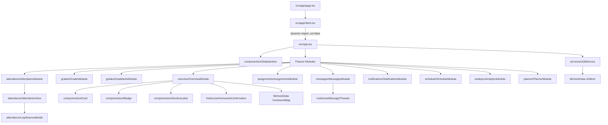

# Design Document — Next.js Codebase Refactor

## Overview

The Kelem Parent Portal is a Next.js 16 + TypeScript application that lets parents monitor their children's academic progress. The current codebase is a monolith: `src/App.tsx` (~3000+ lines) contains all components, mock data, utilities, and business logic in a single file, with two additional large files (`AttendanceView.tsx`, `AnalyticsModule.tsx`) at the `src/` root.

This refactoring decomposes the monolith into a domain-driven directory structure **without changing any UI, UX, or runtime behavior**. The result is a codebase where each concern lives in a predictable location, files stay under 150 lines, and every module can be read, tested, and modified in isolation.

### Goals

- Zero behavioral regression — identical rendered output before and after
- Each file has a single, clear responsibility
- All imports use the `@/` alias (no cross-directory relative paths)
- The application remains buildable (`next build` passes) after every incremental step

### Non-Goals

- No new features
- No changes to Tailwind classes, animation parameters, or JSX structure
- No introduction of new runtime dependencies

---

## Architecture

### Current State

```
src/
  App.tsx              (~3000 lines — all logic, data, components)
  AttendanceView.tsx   (~500 lines)
  AnalyticsModule.tsx  (~400 lines)
  index.css
  app/
    page.tsx
    layout.tsx
    client.tsx
```

### Target State

```
src/
  App.tsx                          (~150 lines — shell only)
  app/
    page.tsx                       (unchanged)
    layout.tsx                     (unchanged)
    client.tsx                     (unchanged)
  components/
    ui/
      Card.tsx
      Badge.tsx
      SectionLabel.tsx
      SidebarItem.tsx
      index.ts
    features/
      overview/
        OverviewModule.tsx
        index.ts
      grades/
        GradesModule.tsx
        GradebookModule.tsx
        index.ts
      attendance/
        AttendanceModule.tsx
        AttendanceView.tsx
        LogAbsenceModal.tsx
        index.ts
      assignments/
        AssignmentsModule.tsx
        index.ts
      messages/
        MessagesModule.tsx
        index.ts
      notifications/
        NotificationsModule.tsx
        index.ts
      schedule/
        ScheduleModule.tsx
        index.ts
      analytics/
        AnalyticsModule.tsx
        index.ts
      planner/
        PlannerModule.tsx
        index.ts
  hooks/
    useHomeworkConfirmation.ts
    useMessageThreads.ts
    index.ts
  lib/
    gradeUtils.ts
    subjectUtils.ts
    mockData.ts
    index.ts
  services/
    childService.ts
    index.ts
  store/                            (empty placeholder)
  types/
    child.ts
    assignment.ts
    message.ts
    notification.ts
    schedule.ts
    index.ts
  styles/
    globals.css
```


### Component Hierarchy



### Data Flow

```mermaid
flowchart LR
    MD[lib/mockData.ts] -->|children: Child[]| CS[services/childService.ts]
    CS -->|getChildren: Promise<Child[]>| APP[App.tsx]
    APP -->|child: Child prop| FM[Feature Modules]
    FM -->|read-only| TY[types/index.ts]
    FM -->|pure functions| LIB[lib/gradeUtils + subjectUtils]
    FM -->|stateful logic| HK[hooks/]
    HK -->|localStorage| LS[(localStorage)]
```

The data flow is strictly top-down. `App.tsx` owns the `selectedChildIdx` state and passes the selected `Child` object down to whichever Feature Module is active. Feature Modules are read-only consumers of the `Child` prop — they never mutate it. Stateful side-effects (localStorage, reply threads) are encapsulated in custom hooks.

---

## Components and Interfaces

### Primitive UI (`src/components/ui/`)

These are domain-agnostic building blocks used across all feature modules.

#### `Card`

```typescript
// src/components/ui/Card.tsx
export interface CardProps {
  children: React.ReactNode;
  className?: string;
  style?: React.CSSProperties;
}
export const Card: React.FC<CardProps>
```

White `rounded-xl` container with `border border-slate-100 shadow-sm`. Accepts optional `className` for overrides and `style` for inline styles (used by PDF export).

#### `Badge`

```typescript
// src/components/ui/Badge.tsx
export interface BadgeProps {
  children: React.ReactNode;
  variant?: "emerald" | "amber" | "red" | "blue" | "slate";
}
export const Badge: React.FC<BadgeProps>
```

Colored pill `<span>`. Defaults to `"blue"`. Maps variant to Tailwind bg+text classes.

#### `SectionLabel`

```typescript
// src/components/ui/SectionLabel.tsx
export interface SectionLabelProps {
  children: React.ReactNode;
}
export const SectionLabel: React.FC<SectionLabelProps>
```

Uppercase `tracking-widest` `<h3>` label. Used as a section header inside cards.

#### `SidebarItem`

```typescript
// src/components/ui/SidebarItem.tsx
export interface SidebarItemProps {
  icon: React.ComponentType<{ size?: number; strokeWidth?: number }>;
  label: string;
  isActive?: boolean;
  count?: number;
  onClick: () => void;
  isCollapsed?: boolean;
}
export const SidebarItem: React.FC<SidebarItemProps>
```

`motion.button` with active/collapsed states. When `isCollapsed=true`, shows only the icon with a red dot indicator for non-zero counts. When active, renders with `bg-[#3949AB]` background.

#### `src/components/ui/index.ts`

```typescript
export { Card } from './Card';
export { Badge } from './Badge';
export { SectionLabel } from './SectionLabel';
export { SidebarItem } from './SidebarItem';
```


### Feature Modules (`src/components/features/`)

Each module receives a `child: Child` prop (except `MessagesModule` which manages its own static thread data, and `PlannerModule` which is a modal overlay).

#### `OverviewModule`

```typescript
// src/components/features/overview/OverviewModule.tsx
export interface OverviewModuleProps {
  child: Child;
  setActiveModule: (module: string) => void;
  onOpenPlanner?: (tab: "weekly" | "academic") => void;
}
export const OverviewModule: React.FC<OverviewModuleProps>
```

Renders: 4 metric cards (grade, attendance, assignments due, missing work), today's homework panel with confirmation button (via `useHomeworkConfirmation`), messages preview, notifications preview, and schedule/planner card pair. Imports `homeworkMap` from `@/lib/mockData`.

#### `GradesModule`

```typescript
// src/components/features/grades/GradesModule.tsx
export interface GradesModuleProps {
  child: Child;
}
export const GradesModule: React.FC<GradesModuleProps>
```

Renders subject grade cards. Clicking a card opens a slide-in drawer (uses `AnimatePresence` from `motion/react`). On mobile the drawer is a bottom sheet; on desktop it is a right panel. The drawer shows subject detail: score, teacher, grade letter, progress bar.

#### `GradebookModule`

```typescript
// src/components/features/grades/GradebookModule.tsx
export interface GradebookModuleProps {
  child: Child;
}
export const GradebookModule: React.FC<GradebookModuleProps>
```

Combines `child.homework`, `child.assignments`, and any exams into a unified `GradebookTask[]` list, deduplicated by `id`. Provides a search bar and type/status filter. On mobile renders a card list; on desktop renders a table. Clicking a row opens a grade detail modal.

```typescript
// Internal type (not exported from types/)
interface GradebookTask {
  id: string;
  title: string;
  subject: string;
  subjectColor: string;
  type: string;
  dueDate: string;
  status: string;
  score: number | null;
  maxScore: number;
  description?: string;
}
```

#### `AttendanceModule`

```typescript
// src/components/features/attendance/AttendanceModule.tsx
export interface AttendanceModuleProps {
  child: Child;
}
export const AttendanceModule: React.FC<AttendanceModuleProps>
```

Thin wrapper. Maps `Child` to the `Student` shape expected by `AttendanceView` and renders `<AttendanceView student={...} />`.

#### `AttendanceView`

```typescript
// src/components/features/attendance/AttendanceView.tsx
export interface AttendanceViewProps {
  student: Student;  // from @/types
}
export const AttendanceView: React.FC<AttendanceViewProps>
```

Moved from `src/AttendanceView.tsx`. Renders stats grid, policy analytics, YTD breakdown, and calendar. Manages `showLogAbsenceModal` state and renders `<LogAbsenceModal>` via `AnimatePresence`.

#### `LogAbsenceModal`

```typescript
// src/components/features/attendance/LogAbsenceModal.tsx
export interface LogAbsenceModalProps {
  studentName: string;
  onClose: () => void;
  onSubmit: (data: AbsenceFormData) => void;
}

export interface AbsenceFormData {
  type: 'Full Day' | 'Partial Day' | 'Multi-Day';
  date?: string;
  startDate?: string;
  endDate?: string;
  fromTime?: string;
  toTime?: string;
  reason: string;
  notes: string;
  notifyTeacher: boolean;
  fileName?: string;
}

export const LogAbsenceModal: React.FC<LogAbsenceModalProps>
```

Split from `AttendanceView.tsx`. Full form with client-side validation: date cannot be in the past, end date must be after start date, reason is required. Renders as a fixed overlay with `motion` entrance/exit animations.

#### `AssignmentsModule`

```typescript
// src/components/features/assignments/AssignmentsModule.tsx
export interface AssignmentsModuleProps {
  child: Child;
}
export const AssignmentsModule: React.FC<AssignmentsModuleProps>
```

Manages internal `filter` state (`"All" | "due" | "submitted" | "graded"`). Renders tab bar and filtered assignment card list. The filtering logic is a pure function extracted for testability.

```typescript
// Pure filter function (exported for testing)
export function filterAssignments(
  assignments: AssignmentEntry[],
  filter: string
): AssignmentEntry[]
```

#### `MessagesModule`

```typescript
// src/components/features/messages/MessagesModule.tsx
export interface MessagesModuleProps {
  child: Child;
  activeThread: number;
  setActiveThread: (i: number) => void;
}
export const MessagesModule: React.FC<MessagesModuleProps>
```

3-pane layout: thread list sidebar, chat panel, teacher profile sidebar. Uses `useMessageThreads` hook for thread state and reply logic. The static thread data (teacher profiles, conversation history) is defined inside the hook.

#### `NotificationsModule`

```typescript
// src/components/features/notifications/NotificationsModule.tsx
export interface NotificationsModuleProps {
  child: Child;
}
export const NotificationsModule: React.FC<NotificationsModuleProps>
```

Renders tab filter (All / Grades / Attendance / Announcements) and notification card list from `child.notifications`.

#### `ScheduleModule`

```typescript
// src/components/features/schedule/ScheduleModule.tsx
export interface ScheduleModuleProps {
  child: Child;
}
export const ScheduleModule: React.FC<ScheduleModuleProps>
```

Renders day tab selector (Mon–Fri) and schedule slot cards from `child.schedule`.

#### `AnalyticsModule`

```typescript
// src/components/features/analytics/AnalyticsModule.tsx
export interface AnalyticsModuleProps {
  child: Child;
}
export const AnalyticsModule: React.FC<AnalyticsModuleProps>
```

Moved from `src/AnalyticsModule.tsx`. Local `Card` and `SectionLabel` definitions removed; imports from `@/components/ui`. Local `getGradeLetter` and `getGradeColorClass` removed; imports from `@/lib/gradeUtils`. Renders bar chart, line chart, pie chart, and 4-week heatmap using Recharts.

#### `PlannerModule`

```typescript
// src/components/features/planner/PlannerModule.tsx
export interface PlannerModuleProps {
  child: Child;
  isOpen: boolean;
  activeTab: "weekly" | "academic";
  onClose: () => void;
  onTabChange: (tab: "weekly" | "academic") => void;
}
export const PlannerModule: React.FC<PlannerModuleProps>
```

Modal overlay containing two tabs: weekly timetable grid and academic calendar. Rendered by `App.tsx` as a top-level overlay. Uses `html2canvas` + `jsPDF` for PDF download functionality.


### Main App Shell (`src/App.tsx`)

After refactoring, `App.tsx` is reduced to ~150 lines containing only:

```typescript
// src/App.tsx
import { getChildren } from '@/services/childService';
import { SidebarItem } from '@/components/ui';
import { OverviewModule } from '@/components/features/overview';
import { GradesModule, GradebookModule } from '@/components/features/grades';
// ... all other feature module imports

export default function App() {
  const [children, setChildren] = useState<Child[]>([]);
  const [activeModule, setActiveModule] = useState("Overview");
  const [selectedChildIdx, setSelectedChildIdx] = useState(0);
  const [activeThread, setActiveThread] = useState(0);
  const [isSidebarCollapsed, setIsSidebarCollapsed] = useState(false);
  const [isMobileMenuOpen, setIsMobileMenuOpen] = useState(false);
  const [showPlannerModal, setShowPlannerModal] = useState(false);
  const [plannerTab, setPlannerTab] = useState<"weekly" | "academic">("weekly");

  // Sidebar nav items, child selector dropdown,
  // mobile bottom nav bar, module routing switch,
  // PlannerModule modal overlay
}
```

The module routing switch maps `activeModule` string to the corresponding Feature Module component. No feature logic, utility functions, or data definitions remain in this file.

---

## Data Models

### `src/types/child.ts`

```typescript
export interface Child {
  id: string;
  name: string;
  initials: string;
  grade: string;
  section: string;
  overallAvg: number;
  attendance: number;
  assignmentsDue: number;
  missingWork: number;
  subjects: Subject[];
  attendance_log: AttendanceLogEntry[];
  homework: HomeworkEntry[];
  assignments: AssignmentEntry[];
  messages: MessageEntry[];
  notifications: NotificationEntry[];
  schedule: ScheduleEntry[];
}

export interface Subject {
  name: string;
  score: number;
  color: string;   // hex color string, e.g. "#3949ab"
  teacher: string;
}

export interface AttendanceLogEntry {
  date: string;    // ISO date string "YYYY-MM-DD"
  status: 'present' | 'absent' | 'late' | 'no-school' | string;
}

// Student shape for AttendanceView (subset of Child)
export interface Student {
  name: string;
  grade: string;
  section: string;
  termAttendance?: number;
  daysPresent?: number;
  totalDays?: number;
  absences?: number;
  lates?: number;
}
```

### `src/types/assignment.ts`

```typescript
export interface HomeworkEntry {
  id: string;
  title: string;
  subject: string;
  subjectColor: string;
  date: string;
  score: number | null;
  maxScore: number;
  status: 'graded' | 'completed' | 'due' | 'pending' | 'missing' | string;
  type: string;
}

export interface AssignmentEntry {
  id: string;
  title: string;
  subject: string;
  subjectColor: string;
  type: string;
  dueDate: string;
  status: 'graded' | 'completed' | 'due' | 'submitted' | 'missing' | string;
  score: number | null;
  maxScore: number;
  description: string;
}
```

### `src/types/message.ts`

```typescript
export interface ThreadMessage {
  sender: 'teacher' | 'parent';
  text: string;
  time: string;
  readAt?: string;
}

export interface MessageThread {
  dateGroup: string;
  messages: ThreadMessage[];
}

export interface MessageEntry {
  id: string;
  teacherName: string;
  teacherInitials: string;
  subject: string;
  preview: string;
  time: string;
  unread: boolean;
  avatarColor?: string;
}
```

### `src/types/notification.ts`

```typescript
export interface NotificationEntry {
  id: string;
  title: string;
  type: 'urgent' | 'info' | 'success' | 'grade' | string;
  category: 'attendance' | 'grade' | 'announcement' | 'system' | string;
  time: string;
  read: boolean;
  detail: string;
}
```

### `src/types/schedule.ts`

```typescript
export interface ScheduleEntry {
  id: string;
  subject: string;
  time: string;
  room: string;
  teacher: string;
  color: string;
  type: string;
}
```

### `src/types/index.ts`

Re-exports all types from the above files.

---

## Hook Signatures

### `useHomeworkConfirmation`

```typescript
// src/hooks/useHomeworkConfirmation.ts
export interface UseHomeworkConfirmationReturn {
  isConfirmed: boolean;
  handleConfirm: () => void;
  resetConfirmation: () => void;
}

export function useHomeworkConfirmation(
  childId: string
): UseHomeworkConfirmationReturn
```

**Behavior:**
- On mount, reads `localStorage.getItem("homework-confirmed-{childId}")` and initializes `isConfirmed` to `true` if the value is `"true"`, `false` otherwise.
- Re-reads on `childId` change (via `useEffect` dependency).
- `handleConfirm()`: sets `isConfirmed = true` and writes `"true"` to `localStorage` under the key. No-op if already confirmed.
- `resetConfirmation()`: sets `isConfirmed = false` and removes the key from `localStorage`.
- All `localStorage` calls are wrapped in try/catch for SSR safety.

### `useMessageThreads`

```typescript
// src/hooks/useMessageThreads.ts
export interface LocalThread {
  id: string;
  teacherName: string;
  teacherInitials: string;
  subject: string;
  gradeLabel: string;
  avatarBg: string;
  time: string;
  unread: boolean;
  studentName: string;
  preview: string;
  phone: string;
  email: string;
  hours: string;
  focusStudent: FocusStudent;
  thread: MessageThread[];
}

export interface UseMessageThreadsReturn {
  threads: LocalThread[];
  selectedIdx: number;
  setSelectedIdx: (i: number) => void;
  replyText: string;
  setReplyText: (text: string) => void;
  handleSend: (e?: React.FormEvent) => void;
  filteredThreads: LocalThread[];
  searchTerm: string;
  setSearchTerm: (term: string) => void;
}

export function useMessageThreads(): UseMessageThreadsReturn
```

**Behavior:**
- Initializes `threads` state with the static 5-thread dataset (currently hardcoded, future: fetched from API).
- `handleSend()`: appends a new `{ sender: "parent", text: replyText, time: "Today, ..." }` message to the current thread's "TODAY" date group (creating the group if absent), clears `replyText`, marks thread as read.
- `filteredThreads`: derived from `threads` filtered by `searchTerm` against `teacherName`, `subject`, and `studentName`.


---

## Service Layer Design

### `src/services/childService.ts`

```typescript
import { Child } from '@/types';
import { CHILDREN } from '@/lib/mockData';

/**
 * Returns the list of children for the current parent.
 * TODO: Replace mock data return with a real API call, e.g.:
 *   const response = await fetch('/api/children');
 *   return response.json();
 */
export async function getChildren(): Promise<Child[]> {
  return Promise.resolve(CHILDREN);
}
```

### `src/services/index.ts`

```typescript
export { getChildren } from './childService';
```

**Design rationale:** Wrapping mock data in an async service function means `App.tsx` already uses the correct calling pattern (`await getChildren()`). When the real API is ready, only `childService.ts` changes — no component code needs to be touched.

---

## Utility Functions

### `src/lib/gradeUtils.ts`

```typescript
/**
 * Returns a Tailwind text-color class for a numeric score.
 * Tiers: ≥75 → emerald, ≥50 → amber, <50 → red
 */
export function getGradeColor(score: number): string

/**
 * Returns Tailwind bg+text+border classes for a numeric score.
 * Tiers match getGradeColor exactly.
 */
export function getGradeBg(score: number): string

/**
 * Returns a letter grade for a numeric score.
 * ≥90→A, ≥80→B, ≥70→C, ≥60→D, <60→F
 */
export function getGradeLetter(score: number): string

/**
 * Returns Tailwind text+bg+border classes using a finer 4-tier scale.
 * Used by AnalyticsModule for its grade color display.
 * ≥85→emerald, ≥70→indigo, ≥55→amber, <55→rose
 */
export function getGradeColorClass(score: number): string

/**
 * Returns a Tailwind bg class for progress bars.
 * ≥85→emerald-500, ≥70→indigo-500, ≥55→amber-500, <55→rose-500
 */
export function getProgressBarColor(score: number): string
```

### `src/lib/subjectUtils.ts`

```typescript
/**
 * Returns a 1–2 character uppercase abbreviation for a subject name.
 * Takes the first two characters of the name and uppercases them.
 * For any non-empty string, returns a string of length 1 or 2.
 */
export function getSubjectInitials(subjectName: string): string
```

### `src/lib/mockData.ts`

```typescript
import { Child } from '@/types';

export const PARENT_NAME: string = "Bekele";

export const CHILDREN: Child[] = [ /* Sara, Yonas, Liya */ ];

export const HOMEWORK_MAP: Record<string, HomeworkItem[]> = {
  "STU-00421": [ /* Sara's homework */ ],
  "STU-00398": [ /* Yonas's homework */ ],
  "STU-00502": [ /* Liya's homework */ ],
};

export interface HomeworkItem {
  title: string;
  subject: string;
  type: string;
  dueDate: string;
  color: string;
  status: string;
  statusVariant: "emerald" | "amber" | "red" | "blue" | "slate";
}
```

### `src/lib/index.ts`

```typescript
export * from './gradeUtils';
export * from './subjectUtils';
export * from './mockData';
```

---

## Correctness Properties

*A property is a characteristic or behavior that should hold true across all valid executions of a system — essentially, a formal statement about what the system should do. Properties serve as the bridge between human-readable specifications and machine-verifiable correctness guarantees.*

This feature involves pure utility functions, custom hooks with localStorage side-effects, and data transformation logic — all of which are well-suited to property-based testing. The recommended PBT library is **fast-check** (TypeScript-native, works in Jest/Vitest).

### Property 1: Grade color exhaustiveness

*For any* integer score in the range [0, 100], `getGradeColor` SHALL return exactly one of `"text-emerald-600"`, `"text-amber-600"`, or `"text-red-600"` — never `undefined`, never an empty string, never any other value.

**Validates: Requirements 5.5**

### Property 2: Grade letter exhaustiveness

*For any* integer score in the range [0, 100], `getGradeLetter` SHALL return exactly one of `"A"`, `"B"`, `"C"`, `"D"`, or `"F"`.

**Validates: Requirements 5.7**

### Property 3: Grade utility tier consistency

*For any* integer score in the range [0, 100], the color tier returned by `getGradeColor` SHALL be consistent with the background tier returned by `getGradeBg` — both functions must agree on which of the three tiers (emerald/amber/red) applies for any given score.

**Validates: Requirements 5.5 (boundary consistency)**

### Property 4: Grade letter monotonicity

*For any* pair of integer scores `s1` and `s2` in [0, 100] where `s1 < s2`, the grade letter returned by `getGradeLetter(s1)` SHALL be less than or equal to `getGradeLetter(s2)` in the ordering F < D < C < B < A.

**Validates: Requirements 5.5 (monotonicity)**

### Property 5: Subject initials bounds

*For any* non-empty subject name string, `getSubjectInitials` SHALL return a string of length 1 or 2 consisting entirely of uppercase ASCII letters (A–Z).

**Validates: Requirements 5.5 (subject initials bounds)**

### Property 6: Homework confirmation round-trip

*For any* valid `childId` string, calling `handleConfirm()` from `useHomeworkConfirmation(childId)` and then reading `localStorage.getItem("homework-confirmed-{childId}")` SHALL return `"true"`, and `isConfirmed` SHALL be `true`.

**Validates: Requirements 7.1**

### Property 7: Homework confirmation reset

*For any* valid `childId` string, calling `resetConfirmation()` after `handleConfirm()` SHALL set `isConfirmed` to `false` and SHALL result in `localStorage.getItem("homework-confirmed-{childId}")` returning `null`.

**Validates: Requirements 7.2**

### Property 8: Homework confirmation isolation

*For any* pair of distinct `childId` strings `id1` and `id2`, confirming homework for `id1` SHALL NOT change the `isConfirmed` state or `localStorage` key for `id2`.

**Validates: Requirements 7.3**

### Property 9: Message thread append and sender correctness

*For any* initial thread state and non-empty reply text string, calling `handleSend` from `useMessageThreads` SHALL increase the total message count in the current thread by exactly 1, and the appended message SHALL have `sender === "parent"` and `text` equal to the sent string.

**Validates: Requirements 7.4, 7.5**

*Note: Properties 7.4 and 7.5 from the requirements are combined here because they test the same operation (handleSend) and one implies the other — verifying the appended message's content subsumes verifying that the count increased by 1.*

### Property 10: Assignment filter subset and correctness

*For any* array of `AssignmentEntry` objects and any non-`"All"` filter value, every item in the filtered result SHALL be present in the original array (subset), and every item SHALL satisfy the filter predicate (correctness).

**Validates: Requirements 10.1, 10.4**

*Note: Subset and correctness are combined — if every result item satisfies the predicate and comes from the input, both properties are verified in one pass.*

### Property 11: Assignment filter idempotence

*For any* array of `AssignmentEntry` objects and any filter value, applying the same filter twice SHALL return the same result as applying it once.

**Validates: Requirements 10.2**

### Property 12: Assignment filter completeness for "All"

*For any* array of `AssignmentEntry` objects, applying the `"All"` filter SHALL return an array of the same length as the input.

**Validates: Requirements 10.3**

### Property 13: Gradebook deduplication and completeness

*For any* combination of `homework`, `assignments`, and `exams` arrays where all IDs are unique across all three arrays, the combined `GradebookTask` list SHALL contain no two items with the same `id`, SHALL have length equal to the sum of the three input array lengths, and SHALL contain every item from every source array.

**Validates: Requirements 11.1, 11.2, 11.3**

*Note: The three gradebook requirements (no duplicates, no items dropped, source completeness) are combined into one property because they all test the same aggregation function and together describe a complete correctness specification for that function.*


---

## Error Handling

### Module Resolution Failures

If `next build` fails after any incremental step, the failure is isolated to that step's changes. The strategy is:

1. Run `next build` after each step (see Incremental Migration Plan).
2. If the build fails, read the TypeScript error output to identify the broken import.
3. Fix only the import in the affected file — do not proceed to the next step until the build passes.
4. Common failure modes:
   - Missing barrel export in `index.ts` — add the missing re-export.
   - Incorrect `@/` path — verify `tsconfig.json` paths and the actual file location.
   - Type mismatch after extraction — ensure the extracted type matches the inline definition exactly.

### localStorage Errors

All `localStorage` access in `useHomeworkConfirmation` is wrapped in try/catch. On SSR (server-side render), `typeof window === 'undefined'` is checked before any `localStorage` call. This prevents hydration errors in Next.js.

### Prop Type Mismatches

The `Child` type in `src/types/child.ts` is the canonical definition. The `AnalyticsModule` previously used an inline prop type with a subset of `Child` fields. After extraction, `AnalyticsModule` accepts `child: Child` directly. The `AttendanceView` uses the `Student` type (a subset of `Child`) — `AttendanceModule` performs the mapping.

### PDF Export

`html2canvas` and `jsPDF` calls remain in `PlannerModule` (weekly timetable PDF) and `OverviewModule` (schedule card PDF buttons). These are not moved to a different execution context. Both libraries require a browser DOM and are only called from event handlers, never during SSR.

---

## Testing Strategy

### Dual Testing Approach

Unit tests cover specific examples, edge cases, and integration points. Property-based tests verify universal properties across all inputs. Both are necessary.

### Property-Based Testing Setup

**Library:** `fast-check` (TypeScript-native, integrates with Vitest or Jest)

```bash
npm install --save-dev fast-check vitest @vitest/coverage-v8
```

Each property test runs a minimum of **100 iterations**. Each test is tagged with a comment referencing the design property:

```typescript
// Feature: nextjs-codebase-refactor, Property 1: Grade color exhaustiveness
it('getGradeColor returns a valid color class for any score in [0,100]', () => {
  fc.assert(
    fc.property(fc.integer({ min: 0, max: 100 }), (score) => {
      const result = getGradeColor(score);
      return ['text-emerald-600', 'text-amber-600', 'text-red-600'].includes(result);
    }),
    { numRuns: 100 }
  );
});
```

### Unit Tests

Unit tests focus on:

- **Specific boundary values**: score = 75, 74, 50, 49, 90, 89, 80, 79, 70, 69, 60, 59 for grade utilities
- **Edge cases for `getSubjectInitials`**: single-character subject names, names with spaces
- **`LogAbsenceModal` validation**: past date rejection, missing required fields, partial day time validation
- **`GradebookModule` aggregation**: arrays with overlapping IDs (deduplication), empty arrays, single-source arrays
- **`filterAssignments`**: empty array input, all items matching filter, no items matching filter

### Integration Tests

After each incremental refactoring step, run:

```bash
next build
```

A passing build (exit code 0, no TypeScript errors) is the integration gate. This verifies:
- All imports resolve correctly
- No circular dependencies
- No type errors introduced by the extraction

### Smoke Tests

After the full refactoring is complete:
- Load the application in a browser
- Verify the initial UI renders for each of the three mock children (Sara, Yonas, Liya)
- Verify the homework confirmation button works and persists across page reloads
- Verify the PDF download buttons in PlannerModule produce a downloadable file

### What Is Not Tested with PBT

- **UI rendering** (Tailwind classes, Framer Motion animations) — verified by visual inspection and smoke tests
- **`next build` success** — integration test (single execution)
- **Directory structure** — smoke test (single assertion)
- **`localStorage` behavior in SSR** — example-based unit test with mocked `window`

---

## Incremental Migration Plan

The refactoring is performed in 10 steps. After each step, `next build` must pass before proceeding.

### Step 1: Directory Structure + CSS Move

**Actions:**
- Create all target directories under `src/`
- Move `src/index.css` → `src/styles/globals.css`
- Update the import in `src/app/layout.tsx` from `'../index.css'` to `'@/styles/globals.css'`

**Verification gate:** `next build` passes. No import errors.

### Step 2: Path Alias Update

**Actions:**
- Update `tsconfig.json`: change `"@/*": ["./*"]` to `"@/*": ["./src/*"]`
- Verify `next.config.mjs` — Next.js 16 resolves `@/` natively from `tsconfig.json`; no webpack alias needed
- Update any existing `@/`-prefixed imports that relied on the old root-relative resolution

**Verification gate:** `next build` passes. All existing imports resolve.

### Step 3: Extract Types

**Actions:**
- Create `src/types/child.ts`, `assignment.ts`, `message.ts`, `notification.ts`, `schedule.ts`, `index.ts`
- Remove duplicate inline interfaces from `AttendanceView.tsx` and `AnalyticsModule.tsx`
- Update all files that defined inline types to import from `@/types`

**Verification gate:** `next build` passes. No type errors.

### Step 4: Extract Utilities

**Actions:**
- Create `src/lib/gradeUtils.ts` with canonical `getGradeColor`, `getGradeBg`, `getGradeLetter`, `getGradeColorClass`, `getProgressBarColor`
- Create `src/lib/subjectUtils.ts` with `getSubjectInitials`
- Create `src/lib/index.ts`
- Remove local utility definitions from `App.tsx` and `AnalyticsModule.tsx`
- Update all usages to import from `@/lib`

**Verification gate:** `next build` passes. No duplicate function definitions.

### Step 5: Extract Mock Data

**Actions:**
- Create `src/lib/mockData.ts` with `CHILDREN`, `PARENT_NAME`, `HOMEWORK_MAP`
- Remove `children`, `parentName`, and `homeworkMap` from `App.tsx` and `OverviewModule`
- Update all references to import from `@/lib/mockData`

**Verification gate:** `next build` passes. Data renders correctly in browser.

### Step 6: Extract Primitive UI Components

**Actions:**
- Create `src/components/ui/Card.tsx`, `Badge.tsx`, `SectionLabel.tsx`, `SidebarItem.tsx`, `index.ts`
- Remove local `Card`, `Badge`, `SectionLabel`, `SidebarItem` definitions from `App.tsx`
- Remove local `Card` and `SectionLabel` from `AnalyticsModule.tsx`
- Update all usages to import from `@/components/ui`

**Verification gate:** `next build` passes. UI renders identically.

### Step 7: Extract Custom Hooks

**Actions:**
- Create `src/hooks/useHomeworkConfirmation.ts`
- Create `src/hooks/useMessageThreads.ts`
- Create `src/hooks/index.ts`
- Replace inline localStorage logic in `OverviewModule` with `useHomeworkConfirmation`
- Replace inline thread state in `MessagesModule` with `useMessageThreads`

**Verification gate:** `next build` passes. Homework confirmation and message reply still work.

### Step 8: Extract Feature Modules (one domain at a time)

Each sub-step extracts one domain. Run `next build` after each.

| Sub-step | Action |
|---|---|
| 8a | Extract `OverviewModule` → `src/components/features/overview/` |
| 8b | Extract `GradesModule` + `GradebookModule` → `src/components/features/grades/` |
| 8c | Move `AttendanceView.tsx`, split `LogAbsenceModal`, create `AttendanceModule` → `src/components/features/attendance/` |
| 8d | Extract `AssignmentsModule` → `src/components/features/assignments/` |
| 8e | Extract `MessagesModule` → `src/components/features/messages/` |
| 8f | Extract `NotificationsModule` → `src/components/features/notifications/` |
| 8g | Extract `ScheduleModule` → `src/components/features/schedule/` |
| 8h | Move `AnalyticsModule.tsx` → `src/components/features/analytics/` |
| 8i | Extract `PlannerModule` → `src/components/features/planner/` |

Each barrel `index.ts` is created alongside the module file.

**Verification gate:** `next build` passes after each sub-step.

### Step 9: Slim Down `App.tsx`

**Actions:**
- Remove all feature component definitions from `App.tsx`
- Replace with imports from `@/components/features/{domain}`
- Verify `App.tsx` is ≤ 150 lines
- Verify `src/app/client.tsx` dynamic import still resolves (`import('../App')`)

**Verification gate:** `next build` passes. `App.tsx` line count ≤ 150.

### Step 10: Create Services Placeholders

**Actions:**
- Create `src/services/childService.ts` with `getChildren(): Promise<Child[]>`
- Create `src/services/index.ts`
- Update `App.tsx` to call `getChildren()` instead of importing `CHILDREN` directly from `@/lib/mockData`
- Ensure no component imports `CHILDREN` directly from `@/lib/mockData`

**Verification gate:** `next build` passes. App loads children data correctly.

### Migration Diagram

```mermaid
gantt
    title Incremental Refactoring Steps
    dateFormat  X
    axisFormat  Step %s

    section Foundation
    Step 1 - Directories + CSS     :done, s1, 0, 1
    Step 2 - Path Alias            :done, s2, 1, 2
    Step 3 - Types                 :done, s3, 2, 3
    Step 4 - Utilities             :done, s4, 3, 4
    Step 5 - Mock Data             :done, s5, 4, 5

    section Components
    Step 6 - Primitive UI          :s6, 5, 6
    Step 7 - Custom Hooks          :s7, 6, 7
    Step 8 - Feature Modules       :s8, 7, 8

    section Finalization
    Step 9 - Slim App.tsx          :s9, 8, 9
    Step 10 - Services             :s10, 9, 10
```



Each step has a clear entry condition (previous build passes) and exit condition (current build passes). This ensures the application is never in a broken state for more than one step at a time.
